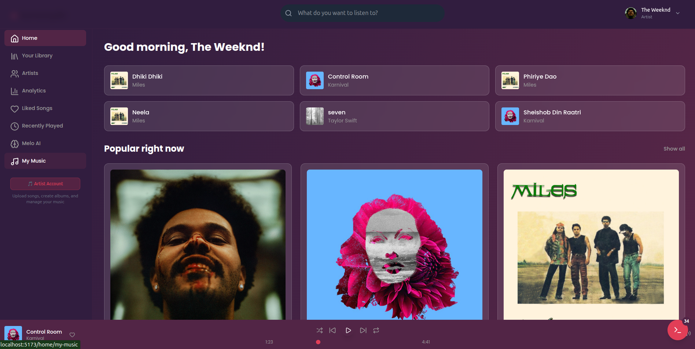
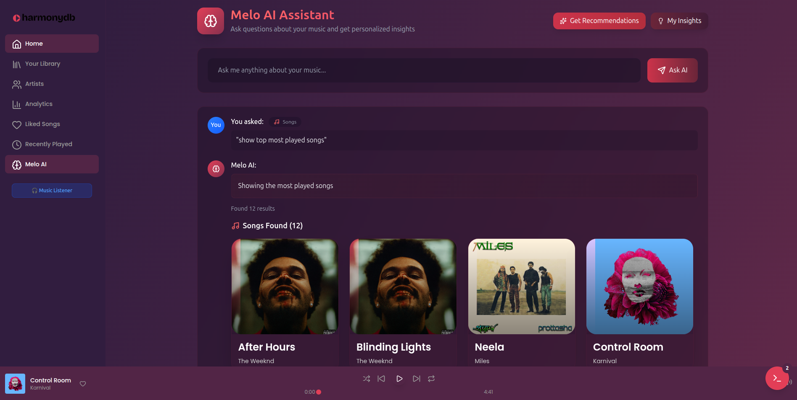

<div align="center">

# HarmonyDB 🎵

**Tagline:** A Spotify-like music library and player with AI-powered natural language queries.

### *A Revolutionary Full-Stack Music Streaming Platform with AI-Powered Database Querying*

---

[](https://www.djangoproject.com/)
[](https://reactjs.org/)
[](https://www.typescriptlang.org/)
[](https://www.postgresql.org/)
[](https://tailwindcss.com/)

---

</div>

## 📋 Table of Contents

- [Project Overview](#project-overview)
- [Key Highlights](#key-highlights)
- [Features](#features)
- [Tech Stack](#tech-stack)
- [Database Schema](#database-schema)
- [Installation](#installation)
- [Running the Project](#running-the-project)
- [Usage](#usage)
- [AI/LLM Integration](#aillm-integration)
- [Project Structure](#project-structure)
- [API Documentation](#api-documentation)
- [Advanced SQL Demonstrations](#advanced-sql-demonstrations)
- [Screenshots](#screenshots)
- [Use Cases](#use-cases)
- [Contributing](#contributing)
- [License](#license)
- [Acknowledgments](#acknowledgments)
- [Contact](#contact)
- [Project Statistics](#project-statistics)

---


2. **📊 Real-Time SQL Query Visualization**- Users (`user_id`, `name`, `email`, `password_hash`, `role`)  

   - Built-in SQL Terminal showing all database operations- Artists (`artist_id`, `stage_name`, `bio`, `profile_picture_url`)  

## 🌟 Overview

**HarmonyDB** is not just another music streaming application—it's a comprehensive demonstration of modern full-stack development practices, advanced database management systems (DBMS) concepts, and cutting-edge AI integration. Built from the ground up as a sophisticated educational and practical project, HarmonyDB showcases:

- **Full-Stack Excellence**: A seamless integration of Django REST Framework backend with a modern React TypeScript frontend
- **Advanced Database Operations**: Real-world implementation of complex SQL queries, window functions, subqueries, and advanced aggregations
- **AI-Powered Interactions**: Natural language to SQL query conversion using state-of-the-art LLM models (Groq API)
- **Production-Ready Features**: JWT authentication, role-based access control, real-time SQL debugging, and comprehensive analytics
- **Educational Value**: Every component designed to demonstrate DBMS concepts in a practical, real-world application

## 🎯 Key Highlights

### 🔥 What Makes HarmonyDB Special

1. **🤖 AI-Powered Natural Language Queries**
   - Ask questions in plain English: *"Show me all songs by The Weeknd from the last 30 days"*
   - Automatic SQL generation and execution
   - Support for complex queries including JOINs, subqueries, aggregations, and window functions
   - Fallback processing for enhanced reliability

2. **📊 Real-Time SQL Query Visualization**
   - Built-in SQL Terminal showing all database operations
   - Query execution time monitoring
   - Beautiful syntax highlighting
   - Educational tool for understanding backend operations

3. **🎭 Dual-Role System Architecture**
   - **Listeners**: Discover music, create playlists, track listening history
   - **Artists**: Upload songs, create albums, manage discography, view analytics

4. **📈 Advanced Analytics Dashboard**
   - Trending songs with sophisticated scoring algorithms
   - User behavior analytics
   - Genre distribution analysis
   - Play count trends and patterns

5. **🔐 Enterprise-Grade Security**
   - JWT-based authentication with token refresh
   - Role-based access control (RBAC)
   - Token blacklisting on logout
   - Secure password hashing with Django's built-in validators

6. **🎨 Modern, Responsive UI/UX**
   - Sleek design with Tailwind CSS 4.x
   - Smooth animations with Framer Motion
   - Responsive across all devices
   - Intuitive navigation and user experiences

## ✨ Features

### 🎵 Music Management
- **Song Upload & Streaming**: High-quality audio file management with cover images
- **Album Organization**: Group songs into albums with metadata and artwork
- **Genre Categorization**: Multi-genre support with custom genre creation
- **Advanced Search**: Full-text search across songs, artists, albums, and genres
- **Audio Player**: Feature-rich player with queue management

### 👤 User Features
- **Multi-Role Authentication**: Separate experiences for Listeners and Artists
- **Profile Management**: Customizable user profiles with bios and profile pictures
- **Playlist Creation**: Unlimited public/private playlists
- **Favorites System**: Like songs, albums, and playlists
- **Listening History**: Track all played songs with timestamps
- **Comments & Engagement**: Comment on songs and albums

### 🎤 Artist Features
- **Music Upload**: Upload songs with detailed metadata
- **Album Management**: Create and manage album collections
- **Analytics Dashboard**: View play counts, listener statistics, and trends
- **Profile Customization**: Stage name, bio, and artist profile picture

### 🤖 AI Assistant (MeloAI)
- **Natural Language Queries**: Ask questions in plain English
- **SQL Generation**: Automatic SQL query generation from natural language
- **Query Execution**: Safe execution of generated queries
- **DBMS Concept Demonstration**: Supports all major SQL concepts

### 📊 Analytics & Insights
- **Trending Analysis**: Identify trending songs based on recent activity
- **User Statistics**: Comprehensive stats for both listeners and artists
- **Genre Analytics**: Distribution and popularity metrics
- **Play Count Tracking**: Automatic increment on song play

## 🛠️ Tech Stack

### Backend
| Technology | Version | Purpose |
|-----------|---------|---------|
| **Django** | 5.2.6 | Core web framework |
| **Django REST Framework** | Latest | RESTful API development |
| **PostgreSQL** | 14+ | Primary database |
| **djangorestframework-simplejwt** | Latest | JWT authentication |
| **django-cors-headers** | Latest | Cross-origin resource sharing |
| **Pillow** | Latest | Image processing |
| **python-dotenv** | Latest | Environment variable management |
| **Groq API** | Latest | LLM for natural language processing |

### Frontend
| Technology | Version | Purpose |
|-----------|---------|---------|
| **React** | 19.1.1 | UI framework |
| **TypeScript** | 5.8.3 | Type-safe JavaScript |
| **Vite** | 7.1.2 | Build tool and dev server |
| **Tailwind CSS** | 4.1.13 | Utility-first CSS framework |
| **Framer Motion** | 12.23.15 | Animation library |
| **React Router** | 7.9.1 | Client-side routing |
| **Lucide React** | Latest | Icon library |

### Development Tools
- **ESLint** - Code quality and consistency
- **TypeScript ESLint** - TypeScript-specific linting
- **Vite Plugin React** - Fast refresh and JSX support

## 💾 Database Schema

### Entity-Relationship Model

Our database schema follows **Third Normal Form (3NF)** principles to eliminate data redundancy and ensure data integrity.

#### Core Tables

**Users Table**
```sql
users (
  id: SERIAL PRIMARY KEY,
  username: VARCHAR(150) UNIQUE NOT NULL,
  email: VARCHAR(254) UNIQUE NOT NULL,
  password: VARCHAR(128) NOT NULL,
  role: VARCHAR(20) CHECK(role IN ('listener', 'artist')),
  email_verified: BOOLEAN DEFAULT FALSE,
  profile_picture: VARCHAR(255),
  bio: TEXT,
  stage_name: VARCHAR(255),  -- For artists
  birth_date: DATE,           -- For listeners
  created_at: TIMESTAMP DEFAULT NOW(),
  updated_at: TIMESTAMP DEFAULT NOW()
)
```

**Songs Table**
```sql
songs (
  id: SERIAL PRIMARY KEY,
  title: VARCHAR(255) NOT NULL,
  artist_id: INT REFERENCES users(id) ON DELETE CASCADE,
  album_id: INT REFERENCES albums(id) ON DELETE SET NULL,
  genre_id: INT REFERENCES genres(id) ON DELETE SET NULL,
  audio_file: VARCHAR(255) NOT NULL,
  cover_image: VARCHAR(255),
  duration: FLOAT DEFAULT 0,
  play_count: INT DEFAULT 0,
  release_date: DATE DEFAULT NOW(),
  upload_date: TIMESTAMP DEFAULT NOW(),
  approved: BOOLEAN DEFAULT TRUE
)
```

**Albums Table**
```sql
albums (
  id: SERIAL PRIMARY KEY,
  title: VARCHAR(255) NOT NULL,
  artist_id: INT REFERENCES users(id) ON DELETE CASCADE,
  cover_image: VARCHAR(255),
  release_date: DATE,
  created_at: TIMESTAMP DEFAULT NOW(),
  updated_at: TIMESTAMP DEFAULT NOW()
)
```

**Playlists & Playlist_Songs (M:N)**
```sql
playlists (
  id: SERIAL PRIMARY KEY,
  name: VARCHAR(255) NOT NULL,
  user_id: INT REFERENCES users(id) ON DELETE CASCADE,
  cover_image: VARCHAR(255),
  is_public: BOOLEAN DEFAULT TRUE,
  created_at: TIMESTAMP DEFAULT NOW()
)

playlist_songs (
  id: SERIAL PRIMARY KEY,
  playlist_id: INT REFERENCES playlists(id) ON DELETE CASCADE,
  song_id: INT REFERENCES songs(id) ON DELETE CASCADE,
  added_at: TIMESTAMP DEFAULT NOW(),
  order: INT DEFAULT 0,
  UNIQUE(playlist_id, song_id)
)
```

**Favorites (Polymorphic)**
```sql
favorites (
  id: SERIAL PRIMARY KEY,
  user_id: INT REFERENCES users(id) ON DELETE CASCADE,
  item_type: VARCHAR(20) CHECK(item_type IN ('song', 'album', 'playlist')),
  item_id: INT NOT NULL,
  created_at: TIMESTAMP DEFAULT NOW(),
  UNIQUE(user_id, item_type, item_id)
)
```

**Listening History**
```sql
listening_history (
  id: SERIAL PRIMARY KEY,
  user_id: INT REFERENCES users(id) ON DELETE CASCADE,
  song_id: INT REFERENCES songs(id) ON DELETE CASCADE,
  listened_at: TIMESTAMP DEFAULT NOW()
)
```

**AI Integration Tables**
```sql
ai_prompts (
  id: SERIAL PRIMARY KEY,
  user_id: INT REFERENCES users(id) ON DELETE CASCADE,
  prompt_text: TEXT NOT NULL,
  response_text: TEXT,
  generated_sql: TEXT,
  executed_result: TEXT,
  created_at: TIMESTAMP DEFAULT NOW()
)

ai_interactions (
  id: SERIAL PRIMARY KEY,
  user_id: INT REFERENCES ai_prompts(id) ON DELETE CASCADE,
  prompt_id: INT REFERENCES ai_prompts(id) ON DELETE CASCADE,
  message_type: VARCHAR(10) CHECK(message_type IN ('user', 'ai')),
  message_text: TEXT NOT NULL,
  timestamp: TIMESTAMP DEFAULT NOW()
)
```

### Key Relationships

- **User → Songs**: One-to-Many (An artist can have many songs)
- **User → Albums**: One-to-Many (An artist can have many albums)
- **User → Playlists**: One-to-Many (A user can have many playlists)
- **Album → Songs**: One-to-Many (An album contains many songs)
- **Genre → Songs**: One-to-Many (A genre can classify many songs)
- **Playlist ↔ Songs**: Many-to-Many (through playlist_songs)
- **User → Favorites**: One-to-Many (Polymorphic relationship)
- **User → Listening History**: One-to-Many

### Database Constraints & Indexes

```sql
-- Unique constraints
CREATE UNIQUE INDEX idx_users_username ON users(username);
CREATE UNIQUE INDEX idx_users_email ON users(email);
CREATE UNIQUE INDEX idx_playlist_songs ON playlist_songs(playlist_id, song_id);

-- Performance indexes
CREATE INDEX idx_songs_artist ON songs(artist_id);
CREATE INDEX idx_songs_album ON songs(album_id);
CREATE INDEX idx_songs_genre ON songs(genre_id);
CREATE INDEX idx_songs_playcount ON songs(play_count DESC);
CREATE INDEX idx_listening_history_user ON listening_history(user_id);
CREATE INDEX idx_listening_history_song ON listening_history(song_id);
CREATE INDEX idx_listening_history_date ON listening_history(listened_at DESC);
```


### System Architecture```

harmonydb/

```│

┌─────────────────────────────────────────────────────────────┐├── harmonydb-backend/

│                     Client Layer (Browser)                   ││   ├── manage.py

│  ┌──────────────────────────────────────────────────────┐  ││   ├── harmonydb/

│  │  React 19 + TypeScript + Tailwind CSS + Vite       │  ││   │   ├── __init__.py

│  │  - Context API (Auth, Player, SQL Debug)            │  ││   │   ├── settings.py

│  │  - React Router (Client-side routing)               │  ││   │   ├── urls.py

│  │  - Framer Motion (Animations)                        │  ││   │   └── wsgi.py

│  └──────────────────────────────────────────────────────┘  ││

└─────────────────────────────────────────────────────────────┘├── harmonydb-frontend/

                            ││   ├── src/

                            │ HTTP/HTTPS (JSON)│   │   ├── components/

                            │ JWT Token Auth│   │   ├── pages/

                            ▼│   │   └── App.tsx

┌─────────────────────────────────────────────────────────────┐│

│                  API Layer (Django REST)                     │├── docs/                 # ER diagrams, schema docs

│  ┌──────────────────────────────────────────────────────┐  │├── media/                # Uploaded music and cover images

│  │  Django 5.2.6 + Django REST Framework                │  │├── requirements.txt

│  │  - JWT Authentication Middleware                     │  │└── README.md

│  │  - CORS Headers Configuration                        │  │```

│  │  - SQL Debug Middleware                              │  │

│  │  - Custom Permission Classes                         │  │---

│  └──────────────────────────────────────────────────────┘  │

└─────────────────────────────────────────────────────────────┘## Contributing

                            │

                            │ ORM / Raw SQL1. Fork the repository.

                            ▼2. Create a branch (`git checkout -b feature-name`).

┌─────────────────────────────────────────────────────────────┐3. Make changes, add tests if needed.

│                   Database Layer                             │4. Commit (`git commit -m "Add feature"`) and push (`git push origin feature-name`).

│  ┌──────────────────────────────────────────────────────┐  │5. Open a Pull Request.

│  │  PostgreSQL 14+                                      │  │

│  │  - 13 Normalized Tables                              │  │---

│  │  - Complex Relationships (1:1, 1:N, M:N)            │  │

│  │  - Indexes and Constraints                           │  │## License

│  │  - Triggers and Views                                │  │

│  └──────────────────────────────────────────────────────┘  │This project is licensed under the MIT License.

└─────────────────────────────────────────────────────────────┘

                            │---

                            │ API Calls

                            ▼**Created by:** Sarwad Hasan Siddiqui

┌─────────────────────────────────────────────────────────────┐**Course:** Database Systems Laboratory (CSE-3110, KUET)

│                    AI/LLM Layer                              │
│  ┌──────────────────────────────────────────────────────┐  │
│  │  Groq API (llama-3.3-70b-versatile)                 │  │
│  │  - Natural Language Understanding                    │  │
│  │  - SQL Query Generation                              │  │
│  │  - Intent Classification                             │  │
│  └──────────────────────────────────────────────────────┘  │
└─────────────────────────────────────────────────────────────┘
```

### Request Flow

1. **User Interaction** → Client sends HTTP request with JWT token
2. **Authentication** → Django validates JWT and user permissions
3. **SQL Debug Middleware** → Captures all SQL queries for debugging
4. **Business Logic** → Views process request using ORM/Raw SQL
5. **Database Operations** → PostgreSQL executes optimized queries
6. **AI Processing** (if needed) → Groq API converts NL to SQL
7. **Response Formation** → Django serializes data + SQL debug info
8. **Client Update** → React updates UI + SQL Terminal

---

## 💾 Database Design

### Entity-Relationship Model

Our database schema follows **Third Normal Form (3NF)** principles to eliminate data redundancy and ensure data integrity.

#### Core Tables

**Users Table**
```sql
users (
  id: SERIAL PRIMARY KEY,
  username: VARCHAR(150) UNIQUE NOT NULL,
  email: VARCHAR(254) UNIQUE NOT NULL,
  password: VARCHAR(128) NOT NULL,
  role: VARCHAR(20) CHECK(role IN ('listener', 'artist')),
  email_verified: BOOLEAN DEFAULT FALSE,
  profile_picture: VARCHAR(255),
  bio: TEXT,
  stage_name: VARCHAR(255),  -- For artists
  birth_date: DATE,           -- For listeners
  created_at: TIMESTAMP DEFAULT NOW(),
  updated_at: TIMESTAMP DEFAULT NOW()
)
```

**Songs Table**
```sql
songs (
  id: SERIAL PRIMARY KEY,
  title: VARCHAR(255) NOT NULL,
  artist_id: INT REFERENCES users(id) ON DELETE CASCADE,
  album_id: INT REFERENCES albums(id) ON DELETE SET NULL,
  genre_id: INT REFERENCES genres(id) ON DELETE SET NULL,
  audio_file: VARCHAR(255) NOT NULL,
  cover_image: VARCHAR(255),
  duration: FLOAT DEFAULT 0,
  play_count: INT DEFAULT 0,
  release_date: DATE DEFAULT NOW(),
  upload_date: TIMESTAMP DEFAULT NOW(),
  approved: BOOLEAN DEFAULT TRUE
)
```

**Albums Table**
```sql
albums (
  id: SERIAL PRIMARY KEY,
  title: VARCHAR(255) NOT NULL,
  artist_id: INT REFERENCES users(id) ON DELETE CASCADE,
  cover_image: VARCHAR(255),
  release_date: DATE,
  created_at: TIMESTAMP DEFAULT NOW(),
  updated_at: TIMESTAMP DEFAULT NOW()
)
```

**Playlists & Playlist_Songs (M:N)**
```sql
playlists (
  id: SERIAL PRIMARY KEY,
  name: VARCHAR(255) NOT NULL,
  user_id: INT REFERENCES users(id) ON DELETE CASCADE,
  cover_image: VARCHAR(255),
  is_public: BOOLEAN DEFAULT TRUE,
  created_at: TIMESTAMP DEFAULT NOW()
)

playlist_songs (
  id: SERIAL PRIMARY KEY,
  playlist_id: INT REFERENCES playlists(id) ON DELETE CASCADE,
  song_id: INT REFERENCES songs(id) ON DELETE CASCADE,
  added_at: TIMESTAMP DEFAULT NOW(),
  order: INT DEFAULT 0,
  UNIQUE(playlist_id, song_id)
)
```

**Favorites (Polymorphic)**
```sql
favorites (
  id: SERIAL PRIMARY KEY,
  user_id: INT REFERENCES users(id) ON DELETE CASCADE,
  item_type: VARCHAR(20) CHECK(item_type IN ('song', 'album', 'playlist')),
  item_id: INT NOT NULL,
  created_at: TIMESTAMP DEFAULT NOW(),
  UNIQUE(user_id, item_type, item_id)
)
```

**Listening History**
```sql
listening_history (
  id: SERIAL PRIMARY KEY,
  user_id: INT REFERENCES users(id) ON DELETE CASCADE,
  song_id: INT REFERENCES songs(id) ON DELETE CASCADE,
  listened_at: TIMESTAMP DEFAULT NOW()
)
```

**AI Integration Tables**
```sql
ai_prompts (
  id: SERIAL PRIMARY KEY,
  user_id: INT REFERENCES users(id) ON DELETE CASCADE,
  prompt_text: TEXT NOT NULL,
  response_text: TEXT,
  generated_sql: TEXT,
  executed_result: TEXT,
  created_at: TIMESTAMP DEFAULT NOW()
)

ai_interactions (
  id: SERIAL PRIMARY KEY,
  user_id: INT REFERENCES users(id) ON DELETE CASCADE,
  prompt_id: INT REFERENCES ai_prompts(id) ON DELETE CASCADE,
  message_type: VARCHAR(10) CHECK(message_type IN ('user', 'ai')),
  message_text: TEXT NOT NULL,
  timestamp: TIMESTAMP DEFAULT NOW()
)
```

### Key Relationships

- **User → Songs**: One-to-Many (An artist can have many songs)
- **User → Albums**: One-to-Many (An artist can have many albums)
- **User → Playlists**: One-to-Many (A user can have many playlists)
- **Album → Songs**: One-to-Many (An album contains many songs)
- **Genre → Songs**: One-to-Many (A genre can classify many songs)
- **Playlist ↔ Songs**: Many-to-Many (through playlist_songs)
- **User → Favorites**: One-to-Many (Polymorphic relationship)
- **User → Listening History**: One-to-Many

### Database Constraints & Indexes

```sql
-- Unique constraints
CREATE UNIQUE INDEX idx_users_username ON users(username);
CREATE UNIQUE INDEX idx_users_email ON users(email);
CREATE UNIQUE INDEX idx_playlist_songs ON playlist_songs(playlist_id, song_id);

-- Performance indexes
CREATE INDEX idx_songs_artist ON songs(artist_id);
CREATE INDEX idx_songs_album ON songs(album_id);
CREATE INDEX idx_songs_genre ON songs(genre_id);
CREATE INDEX idx_songs_playcount ON songs(play_count DESC);
CREATE INDEX idx_listening_history_user ON listening_history(user_id);
CREATE INDEX idx_listening_history_song ON listening_history(song_id);
CREATE INDEX idx_listening_history_date ON listening_history(listened_at DESC);
```

---

## 🤖 AI/LLM Integration

### MeloAI: Natural Language Database Querying

HarmonyDB features **MeloAI**, an intelligent assistant that translates natural language queries into SQL and executes them safely.

#### How It Works

```
User Input (Natural Language)
        ↓
Intent Classification & Entity Extraction
        ↓
SQL Query Generation
        ↓
Query Validation & Safety Check
        ↓
Database Execution
        ↓
Result Formatting & Response
```

#### Supported Query Types

| Category | Examples | SQL Concepts |
|----------|----------|--------------|
| **Basic Search** | "Songs by The Weeknd" | SELECT, WHERE, LIKE |
| **Aggregations** | "How many songs in Rock genre?" | COUNT, AVG, SUM |
| **Sorting & Limiting** | "Top 10 most played songs" | ORDER BY, LIMIT |
| **Date Filtering** | "Songs from last 30 days" | Date functions, BETWEEN |
| **Joins** | "All songs with their albums" | INNER JOIN, LEFT JOIN |
| **Subqueries** | "Album with most songs" | Scalar subquery, EXISTS |
| **Window Functions** | "Rank songs by play count" | ROW_NUMBER, RANK |
| **Group By** | "Total songs by each artist" | GROUP BY, HAVING |
| **User Queries** | "My favorite songs" | User-specific filtering |
| **Text Search** | "Songs containing 'love'" | ILIKE, pattern matching |

#### Example Queries

```python
# Natural Language → SQL Examples

"Show me all songs by The Weeknd"
→ SELECT * FROM songs WHERE artist.stage_name ILIKE '%The Weeknd%' OR artist.username ILIKE '%The Weeknd%'

"How many songs are in the Rock genre?"
→ SELECT COUNT(*) FROM songs WHERE genre.name ILIKE '%Rock%'

"Top 5 most played songs"
→ SELECT * FROM songs ORDER BY play_count DESC LIMIT 5

"Songs uploaded in the last 30 days"
→ SELECT * FROM songs WHERE upload_date >= NOW() - INTERVAL '30 days'

"Show all my favorite songs"
→ SELECT songs.* FROM songs JOIN favorites ON songs.id = favorites.item_id 
  WHERE favorites.user_id = ? AND favorites.item_type = 'song'
```

#### AI Service Architecture

```python
class GroqAIService:
    """
    Processes natural language queries using Groq's LLM API
    """
    def process_music_query(user_query: str) -> dict:
        # 1. Create structured prompt with DBMS concepts
        # 2. Call Groq API (llama-3.3-70b-versatile)
        # 3. Parse JSON response
        # 4. Generate SQL query
        # 5. Return structured data
        
class MusicQueryProcessor:
    """
    Executes structured queries against the database
    """
    def execute_query(ai_response: dict, user) -> dict:
        # 1. Validate intent and entities
        # 2. Build Django ORM query
        # 3. Execute with proper joins
        # 4. Format results
        # 5. Return JSON response
```

#### Safety Features

- **SQL Injection Prevention**: All queries use parameterized statements
- **Permission Checking**: User-specific queries respect authentication
- **Query Timeout**: Automatic timeout for long-running queries
- **Result Limiting**: Maximum result set size to prevent memory issues
- **Audit Logging**: All AI queries logged in `ai_prompts` table

---

## 🚀 Getting Started

### Prerequisites

Before you begin, ensure you have the following installed:

- **Python**: 3.10 or higher
- **Node.js**: 18.x or higher
- **PostgreSQL**: 14.x or higher
- **npm** or **yarn**: Latest version
- **Git**: For version control

### Installation Steps

#### 1. Clone the Repository

```bash
git clone https://github.com/Rockstatata/HarmonyDB.git
cd HarmonyDB
```

#### 2. Backend Setup

**Create and activate a virtual environment:**

```bash
cd harmonydb-backend
python3 -m venv venv

# On Linux/Mac
source venv/bin/activate

# On Windows
venv\Scripts\activate
```

**Install Python dependencies:**

```bash
pip install --upgrade pip
pip install -r requirements.txt
```

**Create a `.env` file in `harmonydb-backend/`:**

```env
# Database Configuration
DB_NAME=harmonydb
DB_USER=postgres
DB_PASSWORD=your_secure_password
DB_HOST=localhost
DB_PORT=5432

# Django Secret Key (Generate a new one for production!)
SECRET_KEY=your-secret-key-here-change-in-production

# Email Configuration (for password reset)
EMAIL_HOST_USER=your-email@gmail.com
EMAIL_HOST_PASSWORD=your-app-specific-password
DEFAULT_FROM_EMAIL=your-email@gmail.com

# Frontend URL
FRONTEND_BASE_URL=http://localhost:5173
BACKEND_BASE_URL=http://localhost:8000

# Groq API Key (for AI features)
GROQ_API_KEY=your-groq-api-key-here
```

**Set up PostgreSQL database:**

```bash
# Login to PostgreSQL
sudo -u postgres psql

# Create database and user
CREATE DATABASE harmonydb;
CREATE USER harmonyuser WITH PASSWORD 'your_secure_password';
GRANT ALL PRIVILEGES ON DATABASE harmonydb TO harmonyuser;
ALTER USER harmonyuser CREATEDB;  # For running tests
\q
```

**Update `harmonydb/settings.py` with your database credentials:**

```python
DATABASES = {
    'default': {
        'ENGINE': 'django.db.backends.postgresql',
        'NAME': 'harmonydb',
        'USER': 'harmonyuser',
        'PASSWORD': 'your_secure_password',
        'HOST': 'localhost',
        'PORT': '5432',
    }
}
```

**Run migrations:**

```bash
python manage.py makemigrations
python manage.py migrate
```

**Create a superuser:**

```bash
python manage.py createsuperuser
# Follow the prompts to create an admin account
```

**Load sample data (optional):**

```bash
python manage.py loaddata fixtures/sample_data.json
```

**Start the Django development server:**

```bash
python manage.py runserver
# Backend will be available at http://localhost:8000
```

#### 3. Frontend Setup

**Open a new terminal and navigate to frontend:**

```bash
cd harmonydb-frontend
```

**Install Node.js dependencies:**

```bash
npm install
# or
yarn install
```

**Create a `.env` file in `harmonydb-frontend/`:**

```env
VITE_API_BASE_URL=http://localhost:8000/api
```

**Start the Vite development server:**

```bash
npm run dev
# or
yarn dev
# Frontend will be available at http://localhost:5173
```

#### 4. Access the Application

- **Frontend**: [http://localhost:5173](http://localhost:5173)
- **Backend API**: [http://localhost:8000/api](http://localhost:8000/api)
- **Django Admin**: [http://localhost:8000/admin](http://localhost:8000/admin)

### Quick Start Testing

1. **Register a new account** as either a Listener or Artist
2. **Verify your email** (check console logs in development)
3. **Login** with your credentials
4. **As a Listener**: Browse songs, create playlists, try MeloAI
5. **As an Artist**: Upload songs, create albums, view analytics

---

## 📁 Project Structure

```
HarmonyDB/
│
├── harmonydb-backend/           # Django Backend
│   ├── manage.py                # Django management script
│   ├── requirements.txt         # Python dependencies
│   ├── schema.sql              # Database schema documentation
│   │
│   ├── harmonydb/              # Main Django project
│   │   ├── __init__.py
│   │   ├── settings.py         # Django settings & configuration
│   │   ├── urls.py             # Root URL configuration
│   │   ├── wsgi.py             # WSGI entry point
│   │   ├── asgi.py             # ASGI entry point
│   │   └── middleware.py       # Custom middleware (SQL Debug)
│   │
│   ├── users/                  # User management app
│   │   ├── models.py           # User model with roles
│   │   ├── views.py            # Authentication views
│   │   ├── serializers.py      # User serializers
│   │   ├── permissions.py      # Custom permissions
│   │   ├── tokens.py           # JWT token handling
│   │   ├── emails.py           # Email verification
│   │   └── urls.py             # User routes
│   │
│   ├── songs/                  # Music management app
│   │   ├── models.py           # Song, Album, Playlist models
│   │   ├── views.py            # CRUD operations & streaming
│   │   ├── serializers.py      # API serializers
│   │   ├── analytics.py        # Analytics & trending
│   │   ├── urls.py             # Song routes
│   │   ├── urls_albums.py      # Album routes
│   │   ├── urls_playlists.py   # Playlist routes
│   │   └── urls_analytics.py   # Analytics routes
│   │
│   ├── meloai/                 # AI assistant app
│   │   ├── models.py           # AI interaction models
│   │   ├── views.py            # AI query endpoints
│   │   ├── services.py         # Groq API integration
│   │   └── urls.py             # AI routes
│   │
│   ├── media/                  # User-uploaded files
│   │   ├── songs/              # Audio files
│   │   ├── song_covers/        # Song cover images
│   │   ├── album_covers/       # Album artwork
│   │   ├── playlist_covers/    # Playlist covers
│   │   └── profile_pictures/   # User avatars
│   │
│   └── templates/              # Email templates
│       └── admin/              # Custom admin templates
│
├── harmonydb-frontend/         # React Frontend
│   ├── package.json            # Node dependencies
│   ├── tsconfig.json           # TypeScript configuration
│   ├── vite.config.ts          # Vite build configuration
│   ├── tailwind.config.js      # Tailwind CSS configuration
│   ├── eslint.config.js        # ESLint configuration
│   ├── index.html              # HTML entry point
│   │
│   ├── src/
│   │   ├── main.tsx            # React entry point
│   │   ├── App.tsx             # Root component
│   │   ├── index.css           # Global styles
│   │   │
│   │   ├── components/         # Reusable components
│   │   │   ├── MediaCard.tsx   # Song/Album card
│   │   │   ├── SQLTerminal.tsx # SQL debug terminal
│   │   │   ├── Home/           # Home page components
│   │   │   ├── Intro/          # Landing page components
│   │   │   └── ui/             # UI primitives
│   │   │
│   │   ├── context/            # React Context providers
│   │   │   ├── authContext.tsx # Authentication state
│   │   │   ├── playerContext.tsx # Music player state
│   │   │   ├── sqlDebugContext.tsx # SQL debug state
│   │   │   └── useSQLDebug.ts  # SQL debug hook
│   │   │
│   │   ├── pages/              # Page components
│   │   │   ├── auth/           # Login/Register pages
│   │   │   ├── home/           # Main application pages
│   │   │   └── Intro/          # Landing pages
│   │   │
│   │   ├── routes/             # Routing configuration
│   │   │   ├── AllRoutes.tsx   # Route definitions
│   │   │   └── ProtectedRoutes.tsx # Auth guards
│   │   │
│   │   ├── services/           # API services
│   │   │   └── apiServices.ts  # HTTP client & endpoints
│   │   │
│   │   ├── types/              # TypeScript types
│   │   │   └── index.ts        # Global type definitions
│   │   │
│   │   └── utils/              # Utility functions
│   │
│   └── public/                 # Static assets
│
├── screenshots/                # Application screenshots (30+)
│
└── README.md                   # This file
```

### Key Files Explained

**Backend:**
- `settings.py`: Django configuration, database setup, middleware, CORS
- `middleware.py`: Custom middleware for SQL query debugging
- `services.py` (meloai): AI integration with Groq API, query processing
- `models.py` (songs): Database models for music entities
- `views.py` (songs): API endpoints with advanced SQL demonstrations

**Frontend:**
- `App.tsx`: Root component with provider setup
- `apiServices.ts`: Centralized API client with JWT handling
- `authContext.tsx`: Authentication state management
- `playerContext.tsx`: Music player state and controls
- `sqlDebugContext.tsx`: Real-time SQL query monitoring
- `AllRoutes.tsx`: Application routing configuration

---

## 📡 API Documentation

### Authentication Endpoints

#### Register User
```http
POST /api/auth/register/
Content-Type: application/json

{
  "username": "johndoe",
  "email": "john@example.com",
  "password": "SecurePass123!",
  "confirm_password": "SecurePass123!",
  "role": "listener"  // or "artist"
}
```

#### Login
```http
POST /api/auth/login/
Content-Type: application/json

{
  "username": "johndoe",
  "password": "SecurePass123!"
}

Response:
{
  "access": "eyJ0eXAiOiJKV1QiLCJhbGc...",
  "refresh": "eyJ0eXAiOiJKV1QiLCJhbGc...",
  "user": {
    "id": 1,
    "username": "johndoe",
    "email": "john@example.com",
    "role": "listener"
  }
}
```

#### Refresh Token
```http
POST /api/auth/token/refresh/
Content-Type: application/json

{
  "refresh": "eyJ0eXAiOiJKV1QiLCJhbGc..."
}
```

### Song Endpoints

#### List Songs
```http
GET /api/songs/?search=weeknd&min_duration=180&max_duration=300
Authorization: Bearer <access_token>

Response includes SQL debug info in headers:
X-SQL-Debug-Count: 3
X-SQL-Debug-Time: 0.045
```

#### Create Song (Artist Only)
```http
POST /api/songs/
Authorization: Bearer <access_token>
Content-Type: multipart/form-data

FormData:
- title: "Blinding Lights"
- audio_file: <file>
- cover_image: <file>
- album: 5
- genre: 2
- duration: 200.5
```

#### Stream Song
```http
GET /api/songs/stream/<song_id>/
Authorization: Bearer <access_token>

Response: Audio file stream
```

### AI Query Endpoints

#### Natural Language Query
```http
POST /api/meloai/query/
Authorization: Bearer <access_token>
Content-Type: application/json

{
  "query": "Show me all songs by The Weeknd from the last 30 days"
}

Response:
{
  "prompt_id": 123,
  "query": "Show me all songs by The Weeknd...",
  "intent": "search_songs",
  "entities": {
    "artist_name": "The Weeknd",
    "date_range": "last_30_days"
  },
  "ai_response": "I'll search for songs by The Weeknd...",
  "result_type": "songs",
  "results": [...],
  "count": 5,
  "sql_query": "SELECT * FROM songs_song WHERE...",
  "success": true
}
```

---

## 🎓 Advanced SQL Demonstrations

HarmonyDB showcases **real-world implementations** of advanced database concepts:

### 1. Window Functions
```python
# Rank songs by play count within each genre
Song.objects.annotate(
    genre_rank=Window(
        expression=Rank(),
        partition_by=[F('genre')],
        order_by=F('play_count').desc()
    )
)

# SQL Generated:
# SELECT *, 
#        RANK() OVER (PARTITION BY genre_id ORDER BY play_count DESC) as genre_rank
# FROM songs_song
```

### 2. Complex Subqueries
```python
# Find albums with more than 10 songs
Album.objects.annotate(
    song_count=Subquery(
        Song.objects.filter(album=OuterRef('pk'))
        .values('album')
        .annotate(count=Count('id'))
        .values('count')
    )
).filter(song_count__gt=10)

# SQL Generated:
# SELECT * FROM songs_album
# WHERE (SELECT COUNT(*) FROM songs_song 
#        WHERE songs_song.album_id = songs_album.id) > 10
```

### 3. Aggregation with GROUP BY
```python
# Total play count by genre
Genre.objects.annotate(
    total_plays=Sum('song__play_count'),
    avg_duration=Avg('song__duration'),
    song_count=Count('song')
).order_by('-total_plays')

# SQL Generated:
# SELECT genre_id, 
#        SUM(play_count) as total_plays,
#        AVG(duration) as avg_duration,
#        COUNT(*) as song_count
# FROM songs_song
# GROUP BY genre_id
# ORDER BY total_plays DESC
```

### 4. Complex JOINs
```python
# Songs with artist and album info (LEFT JOINs)
Song.objects.select_related('artist', 'album', 'genre')\
    .prefetch_related('listening_history', 'in_playlists')

# SQL Generated (simplified):
# SELECT s.*, a.*, al.*, g.*
# FROM songs_song s
# INNER JOIN users_user a ON s.artist_id = a.id
# LEFT OUTER JOIN songs_album al ON s.album_id = al.id
# LEFT OUTER JOIN songs_genre g ON s.genre_id = g.id
```

### 5. Date/Time Operations
```python
# Trending songs: recent plays with exponential decay
from django.utils import timezone
from datetime import timedelta

now = timezone.now()
week_ago = now - timedelta(days=7)

Song.objects.annotate(
    recent_plays=Count(
        'listening_history',
        filter=Q(listening_history__listened_at__gte=week_ago)
    ),
    trending_score=F('recent_plays') * 10 + F('play_count') / 100
).order_by('-trending_score')

# SQL Generated:
# SELECT *,
#        COUNT(CASE WHEN listened_at >= '2024-10-22' THEN 1 END) as recent_plays,
#        (recent_plays * 10 + play_count / 100) as trending_score
# FROM songs_song
# ORDER BY trending_score DESC
```

### 6. CASE Statements (Conditional Logic)
```python
# Categorize songs by popularity
Song.objects.annotate(
    popularity_tier=Case(
        When(play_count__gte=1000, then=Value('viral')),
        When(play_count__gte=100, then=Value('popular')),
        When(play_count__gte=10, then=Value('rising')),
        default=Value('new'),
        output_field=CharField()
    )
)

# SQL Generated:
# SELECT *,
#        CASE 
#            WHEN play_count >= 1000 THEN 'viral'
#            WHEN play_count >= 100 THEN 'popular'
#            WHEN play_count >= 10 THEN 'rising'
#            ELSE 'new'
#        END as popularity_tier
# FROM songs_song
```

---

## 📸 Screenshots

### Landing Page
<table>
  <tr>
    <td></td>
    <td></td>
  </tr>
</table>

### Authentication
<table>
  <tr>
    <td></td>
    <td></td>
  </tr>
</table>

### Listener Dashboard
<table>
  <tr>
    <td></td>
    <td></td>
  </tr>
  <tr>
    <td></td>
    <td></td>
  </tr>
</table>

### Artist Dashboard
<table>
  <tr>
    <td></td>
    <td></td>
  </tr>
  <tr>
    <td></td>
    <td></td>
  </tr>
</table>

### MeloAI - Natural Language Queries
<table>
  <tr>
    <td></td>
    <td></td>
  </tr>
  <tr>
    <td colspan="2" align="center"></td>
  </tr>
</table>

### SQL Terminal (Real-time Query Visualization)
<table>
  <tr>
    <td colspan="2" align="center"></td>
  </tr>
</table>

### Music Library & Playlists
<table>
  <tr>
    <td></td>
    <td></td>
  </tr>
  <tr>
    <td></td>
    <td></td>
  </tr>
</table>

### Analytics & Profiles
<table>
  <tr>
    <td></td>
    <td></td>
  </tr>
  <tr>
    <td></td>
    <td></td>
  </tr>
</table>

---

## 🎯 Use Cases

### For Students & Educators

- **Database Systems Course**: Comprehensive demonstration of DBMS concepts
- **Web Development**: Full-stack architecture with modern frameworks
- **API Design**: RESTful API best practices
- **SQL Learning**: Real-world SQL query examples
- **AI Integration**: Practical LLM application

### For Developers

- **Portfolio Project**: Showcase full-stack capabilities
- **Learning Resource**: Study modern React + Django integration
- **Architecture Reference**: Clean, scalable codebase structure
- **API Template**: JWT authentication patterns
- **Real-time Features**: SQL debugging implementation

### For Music Enthusiasts

- **Personal Music Library**: Organize your music collection
- **Playlist Management**: Create and share playlists
- **Discovery**: Explore new artists and genres
- **Analytics**: Track listening habits

---

## 🤝 Contributing

Contributions are welcome! Whether it's bug fixes, new features, or documentation improvements, your help makes HarmonyDB better.

### How to Contribute

1. **Fork the repository**
2. **Create a feature branch** (`git checkout -b feature/amazing-feature`)
3. **Make your changes** - Follow existing code style and add comments
4. **Test your changes** - Ensure everything works properly
5. **Commit your changes** (`git commit -m "Add some amazing feature"`)
6. **Push to your fork** (`git push origin feature/amazing-feature`)
7. **Open a Pull Request** - Describe your changes and reference any related issues

### Development Guidelines

- **Code Style**: Follow PEP 8 for Python, ESLint for TypeScript
- **Commits**: Use descriptive commit messages
- **Documentation**: Update README for new features
- **Testing**: Add tests for new functionality
- **Security**: Never commit sensitive data (.env files)

---

## 📄 License

This project is licensed under the **MIT License**. You are free to use, modify, and distribute this software.

---

## 🙏 Acknowledgments

### Course Information
- **Course**: Database Systems Laboratory (CSE-3110)
- **Institution**: Khulna University of Engineering & Technology (KUET)
- **Academic Year**: 2024-2025

### Technologies Used
- **Django & Django REST Framework** - Backend framework
- **React & TypeScript** - Frontend framework
- **PostgreSQL** - Database system
- **Groq API** - LLM integration
- **Tailwind CSS** - Styling framework
- **Framer Motion** - Animation library
- **Vite** - Build tool

### Inspiration
- **Spotify** - UI/UX inspiration
- **YouTube Music** - Feature ideas
- **Database Management Systems** by Raghu Ramakrishnan - Theoretical foundation
- **Django for APIs** by William S. Vincent - API design patterns

### Special Thanks
- Stack Overflow community for debugging help
- Django & React documentation teams
- Open-source contributors worldwide

---

## 📞 Contact & Support

### Developer
**Sarwad Hasan Siddiqui**
- GitHub: [@Rockstatata](https://github.com/Rockstatata)
- Course: Database Systems Laboratory (CSE-3110, KUET)

### Project Links
- **Repository**: [https://github.com/Rockstatata/HarmonyDB](https://github.com/Rockstatata/HarmonyDB)
- **Issues**: [Report a Bug](https://github.com/Rockstatata/HarmonyDB/issues)

### Support
If you find this project helpful, consider:
- ⭐ **Starring** the repository
- 🐛 **Reporting** bugs and issues
- 💡 **Suggesting** new features
- 📖 **Improving** documentation
- 🤝 **Contributing** code

---

## 📊 Project Statistics

```
📁 Total Files:        150+
📝 Lines of Code:      25,000+
🗄️  Database Tables:    13
🔗 API Endpoints:      40+
📸 Screenshots:        30+
⏱️  Development Time:   200+ hours
🎓 Concepts Covered:   30+ DBMS concepts
```

---

<div align="center">

### ⭐ Star this repository if you find it helpful!

**Made with ❤️ by Sarwad Hasan Siddiqui**

*Demonstrating the power of modern web development and database systems*

</div>
